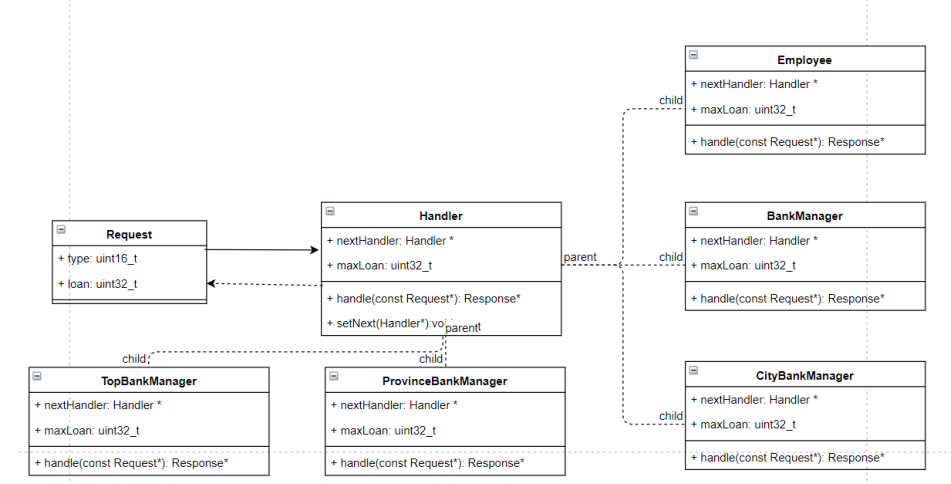

# 责任链模式

# 1. 概念

> 顾名思义，责任链模式（Chain of Responsibility Pattern）为请求创建了一个接收者对象的链。这种模式给予请求的类型，对请求的发送者和接收者进行解耦。这种类型的设计模式属于行为型模式。

​    在这种模式中，通常每个接收者都包含对另一个接收者的引用。如果一个对象不能处理该请求，那么它会把相同的请求传给下一个接收者，依此类推。

​    职责链可以是一条直线、一个环或者一个树形结构，最常见的职责链是直线型，即沿着一条单向的链来传递请求。链上的每一个对象都是请求处理者，职责链模式可以将请求的处理者组织成一条链，并让请求沿着链传递，由链上的处理者对请求进行相应的处理，客户端无须关心请求的处理细节以及请求的传递，只需将请求发送到链上即可，实现请求发送者和请求处理者解耦。

# 2. 实现

责任链模式结构重要核心模块：

## 2.1 Handler（抽象处理者）

定义一个处理请求的接口，一般设计为抽象类，由于不同的具体处理者处理请求的方式不同，因此在其中定义了抽象请求处理方法。因为每一个处理者的下家还是一个处理者，因此在抽象处理者中定义了一个抽象处理者类型的对象作为其对下家的引用。通过该引用，处理者可以连成一条链。（是不是有点像C语言的链表结构呢？）

## 2.2 ConcreteHandler（具体处理者）

抽象处理者的子类，可以处理用户请求，在具体处理者类中实现了抽象处理者中定义的抽象请求处理方法，在处理请求之前需要进行判断，看是否有相应的处理权限，如果可以处理请求就处理它，否则将请求转发给后继者；在具体处理者中可以访问链中下一个对象，以便请求的转发。

# 3. 分类

## 3.1 纯的职责链模式

一个纯的职责链模式要求一个具体处理者对象只能在两个行为中选择一个：要么承担全部责任，要么将责任推给下家，不允许出现某一个具体处理者对象在承担了一部分或全部责任后又将责任向下传递的情况。而且在纯的职责链模式中，要求一个请求必须被某一个处理者对象所接收，不能出现某个请求未被任何一个处理者对象处理的情况。

## 3.2 不纯的职责链模式

在一个不纯的职责链模式中允许某个请求被一个具体处理者部分处理后再向下传递，或者一个具体处理者处理完某请求后其后继处理者可以继续处理该请求，而且一个请求可以最终不被任何处理者对象所接收。

 

# 4. 过滤器模式

1. 相同点

用户无需关心链上有哪些处理者

2. 不同点

责任链模式下，某个请求会在责任链上的某个处理者处理完成后中止。而在过滤器模式下，需要遍历整个责任链

# 5. 应用场景

- nginx http filter

# 6. 编译说明
`g++ -std=c++11 -o chain main.cpp`

To be continued......
